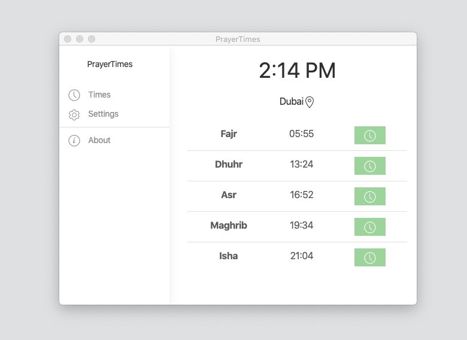

# PrayerTimes

Desktop application built with electronjs.


## Getting Started

```shell
npm install
npm run webpack
npm run electron
```

.env
```shell
GOOGLE_API_KEY=
DEBUG=false
```

## Layout Structure 
It allow me to have a fullscreen window, or Page with shared content such sidemenu

[app.html]('src/render/layouts/app.html')

```
  <router-view>
     <Page>
        <Main>
           <Content>
        </Main>
     </Page>
     ..
     <Page>
        <Main>
           <Content>
        </Main>
     </Page>
  </router-view>
```