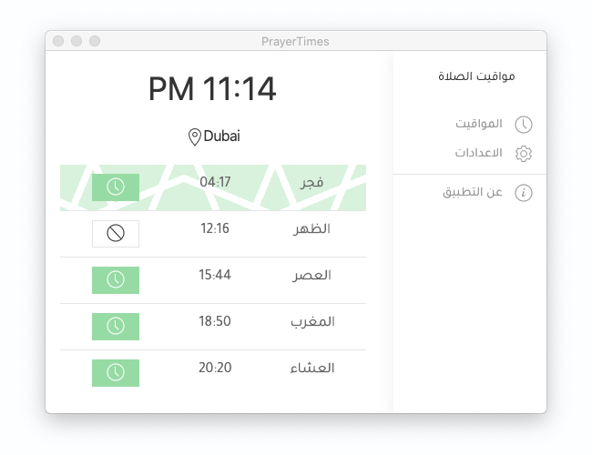

# PrayerTimes


Desktop application built with electronjs.



## Download

### macOS

Download [the latest release](https://github.com/cogtea/prayertimes/releases/download/1.0.6/PrayerTimes-1.0.6.dmg)

### windows

Download [the latest release](https://github.com/cogtea/prayertimes/releases/download/1.0.6/PrayerTimes.Setup.1.0.6.exe)

### linux

- [ ] TODO  test and build.

## Getting Started

```shell
npm install
npm run webpack
npm run electron
```

## Layout Structure 
It allow me to have a fullscreen window, or Page with shared content such sidemenu

[app.html]('src/render/layouts/app.html')

```
  <router-view>
     <Page>
        <Main>
           <Content>
        </Main>
     </Page>
     ..
     <Page>
        <Main>
           <Content>
        </Main>
     </Page>
  </router-view>
```
